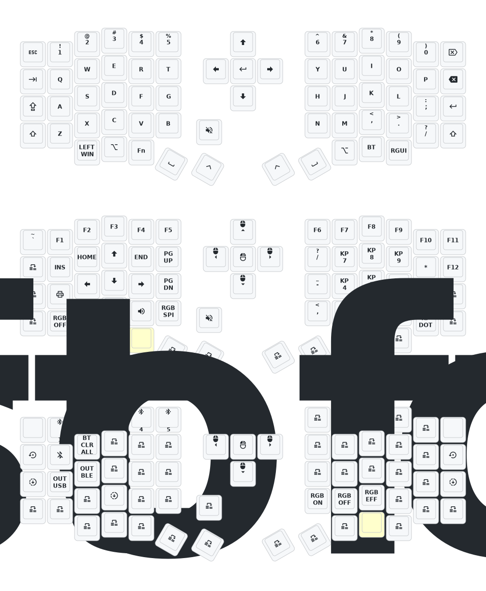

# Sofle Keymap

# Qwerty
Pour saisir une lettre avec un accent grave, pressez la touche ` suivie de la voyelle.

Pour saisir une lettre avec un accent aigu, pressez la touche ' suivie de la voyelle.

Pour saisir une cédille pressez la touche ' suivie de la touche c.

Pour saisir une lettre avec un accent circonflexe, pressez la touche ^ (Maj+6) suivie de la voyelle.

Pour saisir un tréma, pressez la touche " (Maj + ') suivie de la voyelle.

Pour ne saisir qu'un symbole, pressez sa touche suivie de la touche espace. Pour saisir par exemple j'ai, vous devez taper j, ', espace, a et i. !

https://miamioh.edu/cas/centers-institutes/interactive-language-resource-center/tech-support/